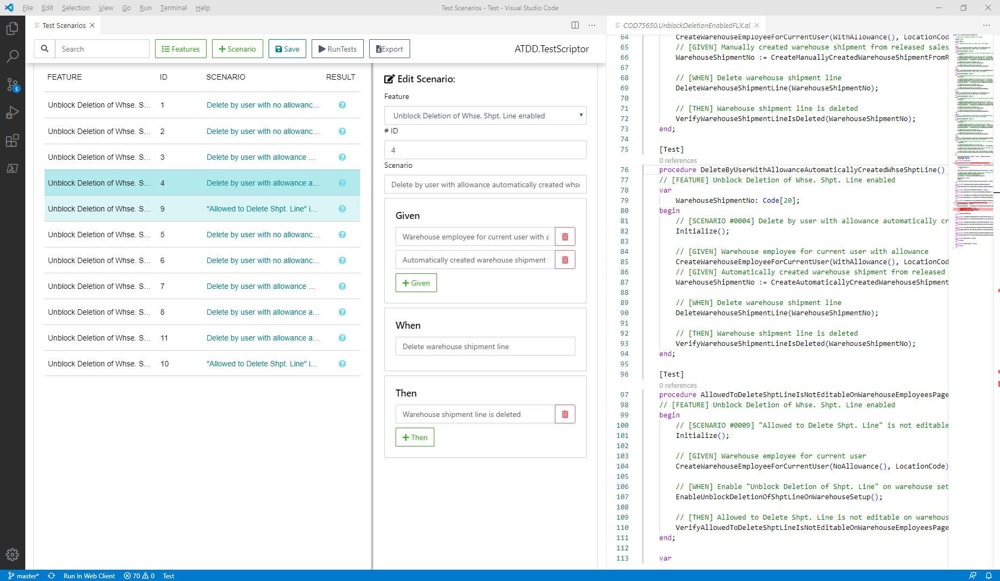

# ATDD.TestScriptor.VSCodeExtension
VSCode extension for Acceptance Test-Driven Development test scriptor aka ATDD.TestScriptor V2 as follow up on [ATDD.TestScriptor](https://github.com/fluxxus-nl/ATDD.TestScriptor).

The Acceptance Test-Driven Development test scriptor allows the user to define in a managed matter ATDD test scenarios and convert it into a code structure to facilate fast test code development. At this moment this conversion is only implemented for .al

The ATDD pattern is defined by so called tags:

*	FEATURE: defines what feature(s) the test or collection of test cases is testing
*	SCENARIO: defines for a single test the scenario being teste
*	GIVEN: defines what data setup is needed; a test case can have multiple GIVEN tags when data setup is more complex
*	WHEN: defines the action under test; each test case should have only one WHEN tag
*	THEN: defines the result of the action, or more specifically the verification of the result; if multiple results apply, multiple THEN tags will be needed

This projct is at this moment WIP. Have a look at how we think it is going to look like:

